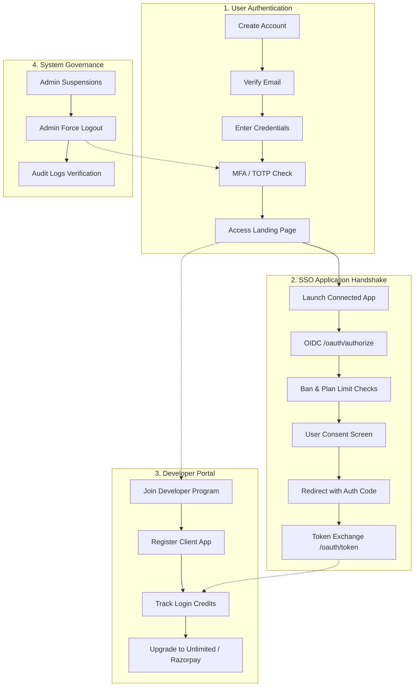

# The Complete Step-by-Step Functional Guide: How WytPass Works

This guide explains the step-by-step lifecycles of **WytPass SSO**. It walks you through standard user accounts, developer workspaces, OIDC/PKCE app handshakes, billing upgrades, and admin security panels.

---

## High-Level Visual Flow of WytPass SSO

---

## Section 1: Standard User Sign-Up & Sign-In Journey
Traces how a brand-new user registers, activates their profile, signs in with MFA, and explores their dashboard.

### Step 1: Account Registration
The user goes to the WytPass portal registration page (`/register`).
*   **User Action**: Enters their Full Name, Email, and Password, then clicks **Sign Up**.
*   **System Action**: 
    1. The React frontend sends a `POST` request with the credentials to the FastAPI backend (`/v1/auth/register`).
    2. The backend validates the inputs and uses Bcrypt to secure the password:
       $$\text{HashedPassword} = \text{Bcrypt}(\text{"UserPassword123"}) $$
    3. Writes a new record to the database `USER` table.
    4. Generates a secure, temporary registration token.
    5. Sends an automated verification email to the user with their unique link:
       `https://wytnet.com/verify-email?token=unique_token_string`

### Step 2: Account Activation
The user checks their inbox.
*   **User Action**: Clicks the activation link in their verification email.
*   **System Action**:
    1. The link loads the frontend, which calls `GET /v1/auth/verify-email?token=unique_token_string` on the backend.
    2. The backend looks up the token, confirms its validity, and updates the `USER` table:
       `email_verified = True`
    3. Returns a success message. The user is now active and ready to log in.

### Step 3: Login Verification
The user navigates to the login screen (`/login`).
*   **User Action**: Enters their email and password, then clicks **Login**.
*   **System Action**:
    1. The frontend submits the credentials to `POST /v1/auth/login`.
    2. The backend retrieves the user by email and compares the passwords:
       $$\text{VerifyPassword}(\text{"UserPassword123"}, \text{HashedPassword}) \stackrel{?}{=} \text{True}$$
    3. Checks if Multi-Factor Authentication (MFA) is active.
        *   **MFA Disabled**: Generates JWT access/refresh tokens immediately and saves them in secure **HTTP-only cookies** (`access_token`).
        *   **MFA Enabled**: Intercepts the login, returns a short-lived `temp_token`, and prompts the user for a 6-digit verification code.

### Step 4: Two-Factor Binding & Verification (MFA)
The user configures security features.
*   **User Action**: Navigates to `/security`, scans the generated QR code with their authenticator app, and enters the 6-digit confirmation code.
*   **System Action**:
    1. The backend generates a cryptographically secure TOTP secret key and formats it as a standard URI:
       `otpauth://totp/WytPass:user@email.com?secret=TOTP_SECRET_KEY&issuer=WytPass`
    2. The user's device displays the changing 6-digit codes.
    3. During subsequent logins, the user submits the code. The backend verifies the key calculation:
       $$\text{ComputeTOTP}(\text{SecretKey}, \text{CurrentTime}) \stackrel{?}{=} \text{UserCode}$$
    4. Upon successful validation, it issues the final authorization cookie.

### Step 5: Landing Dashboard Display
The user successfully authenticates.
*   **User Action**: The dashboard redirects the user to the landing portal (`/explore`).
*   **System Action**:
    1. The React app calls `GET /v1/clients/public`.
    2. The backend queries the database for all active developer-registered applications:
       `SELECT * FROM oauth_client WHERE is_active = True;`
    3. The frontend displays the apps as a catalog (e.g., *Vote Smart AI*, *Open Madurai*, *News Portal*), with **Launch** buttons for each app.

---

## Section 2: SSO Login Journey on a Specific App
Traces what happens under the hood when a user logs into a connected app (like *Vote Smart AI*) using their WytPass account.

### Step 6: Initializing the Login Handshake
The user launches a third-party app.
*   **User Action**: Launches the target client app (e.g., *Vote Smart AI*) and clicks **Login with WytPass**.
*   **System Action**:
    1. The client app generates a random string $V$ (the `code_verifier`).
    2. Computes the SHA-256 hash of $V$ and encodes it in Base64URL to create the `code_challenge` $C$:
       $$C = \text{Base64URL-Encode}(\text{SHA-256}(V))$$
    3. Redirects the user's browser to WytPass's authorization page.

### Step 7: Authorization Redirect & Parameter Check
The user's browser is redirected to WytPass.
*   **User Action**: Browser loads `https://wytnet.com/oauth/authorize?response_type=code&client_id=...&code_challenge=...&redirect_uri=...`
*   **System Action**:
    1. The WytPass backend verifies the `client_id` to ensure the app is registered.
    2. Matches the request's `redirect_uri` against the app's registered redirect whitelist to prevent redirection hijacking.
    3. Queries the `AppBan` table to verify the user is not banned from this specific app.
    4. Evaluates the developer's subscription plan. If the app is on the Free plan and exceeds its 2 unique user limit, redirects to `/banned?reason=out_of_credits`.

### Step 8: User Consent Confirmation
The user grants permissions.
*   **User Action**: Reviews the requested scopes (e.g., read email, profile name) on the consent screen and clicks **Confirm & Authorize**.
*   **System Action**:
    1. The frontend redirects back to the authorization endpoint with confirmation approval: `/oauth/authorize?...&confirm=true`.
    2. The backend generates a short-lived, 32-character authorization code (`code_auth_xyz`), associates it with the user ID and code challenge, and stores it in the database.
    3. Sends a `302 Found` redirect to the app's callback URL, returning the code and state:
       `Location: https://votesmart.ai/callback?code=code_auth_xyz&state=state_abc`

### Step 9: Client Callback & Authorization Code Extraction
The client app receives the authorization code.
*   **User Action**: The browser redirects back to the client application.
*   **System Action**:
    1. The client app intercepts the redirect and extracts the `code` and `state` parameters.
    2. Validates that the returned `state` matches the value sent in Step 6 to prevent CSRF attacks.

### Step 10: OIDC JWT Token Exchange
The client app exchanges the code for tokens.
*   **System Action (Server-to-Server)**:
    1. The client app sends a `POST` request to `/oauth/token` with the authorization code and the original plaintext `code_verifier` ($V$).
    2. The WytPass backend consumes the authorization code and verifies the PKCE handshake:
       $$\text{Base64URL-Encode}(\text{SHA-256}(V)) \stackrel{?}{=} \text{OriginalCodeChallenge}$$
    3. If valid, the backend retrieves the user profile and signs the JWT tokens using its private RSA-256 key:
        *   **Access Token**: To authenticate subsequent API requests.
        *   **OIDC ID Token**: A signed JWT containing user claims (`email`, `full_name`, `avatar_url`).
        *   **Refresh Token**: To request new access tokens.
    4. Returns the tokens to the client app in a JSON payload. The client app logs the user in and displays the application dashboard.

---

## Section 3: Developer Workspace Lifecycle
Traces how a user joins the developer program, registers an application, and integrates it.

### Step 11: Joining the Developer Program
A user signs up as a platform developer.
*   **User Action**: User goes to `/dashboard` and clicks **Join Developer Program**.
*   **System Action**:
    1. The frontend calls `POST /v1/plans/join-developer-program`.
    2. The backend updates the user's role to `app_admin` in the database.
    3. Seeds a new workspace associated with the user, assigning them to the default **Free Developer Plan** (pre-configured with a 2 unique user login limit).
    4. Returns a success response. The developer tab is now unlocked in the portal console.

### Step 12: Registering a Client Application
The developer registers a new client application.
*   **User Action**: Navigates to the Developer panel, enters the application name and allowed redirect callback URLs, and clicks **Create**.
*   **System Action**:
    1. The frontend submits a `POST` request to `/v1/clients` with the application configurations.
    2. The backend generates a secure `client_id` and a random client secret.
    3. Hashes the secret using Bcrypt and saves the record in the `OAUTH_CLIENT` table:
       `client_secret_hash = HashedSecret`
    4. Links the developer's user ID to the application in the `CLIENT_ADMIN` table.
    5. Returns the client credentials.

### Step 13: Integrating the Client Credentials
The developer integrates WytPass into their application.
*   **User Action**: Copies the generated `client_id` and `client_secret` and configures them in their application's environment settings.
*   **System Action**: The developer's application uses these keys to secure back-channel communications with WytPass (e.g., verifying client credentials during OIDC token exchanges).

### Step 14: Selective App User Banning
A developer blocks a compromised user from accessing their application.
*   **User Action**: Developer goes to the app's user management panel and clicks **Ban User** next to the user's email.
*   **System Action**:
    1. The React app submits a request to `POST /v1/clients/{client_uuid}/bans`.
    2. The backend writes the ban configuration to the `APP_BAN` table, mapping the targeted `user_id` to the `client_id`.
    3. During subsequent logins, WytPass interceptors verify this record and block the user before issuing any codes.

---

## Section 4: Developer Upgrade & Razorpay Integration
Traces how WytPass monitors developer plan limits, triggers notifications, and handles premium upgrades using Razorpay.

### Step 15: Credit Capacity Monitoring
WytPass tracks usage limits during authentication.
*   **System Action**: When a new user logs into a client app, WytPass calls `check_credits()` to aggregate the unique users associated with the application:
    $$\text{UniqueUsersCount} = \text{Count}(\text{Unique Authorized Users}) $$
*   **Limit Enforcement**:
    *   *Below Limit*: Authorizes the login, increments `credits_used`, and logs a `trust_login` event in the `CreditLog`.
    *   *80% Threshold Reached*: If usage reaches 80% (e.g. 2/2 users for the Free plan), the email service dispatches a warning notification to the developer to upgrade their plan.
    *   *Over Limit*: Blocks new user registrations and redirects them to the `/banned?reason=out_of_credits` page.

### Step 16: Initializing a Razorpay Payment Order
The developer upgrades their plan to remove limits.
*   **User Action**: Developer clicks **Upgrade Workspace to Unlimited (₹1)**.
*   **System Action**:
    1. The frontend console calls `POST /v1/plans/create-razorpay-order?plan_id=unlimited`.
    2. The backend converts the ₹1.00 price into paise:
       $$\text{Amount} = 1.00 \times 100 = 100 \text{ paise}$$
    3. Calls the Razorpay API to generate a secure payment order ID:
       `client.order.create(amount=100, currency="INR")`
    4. Returns the Razorpay `order_id` and the platform public key to the frontend.

### Step 17: Processing Razorpay Payments
The developer completes the payment.
*   **User Action**: The Razorpay payment overlay opens. The developer enters their card or UPI details and clicks **Pay Now**.
*   **System Action**:
    1. Razorpay processes the transaction and returns secure payment tokens to the frontend:
       `razorpay_payment_id`, `razorpay_signature`
    2. The frontend submits these tokens to `/v1/plans/verify-razorpay-payment` on the backend to verify the transaction.

### Step 18: Signature Verification & Upgrading Plans
The backend verifies the transaction and applies the upgrade.
*   **System Action**:
    1. The backend validates the payment signature using HMAC-SHA256:
       $$\text{ExpectedSignature} = \text{HMAC-SHA256}(\text{order\_id} \mathbin{\Vert} \text{"|"} \mathbin{\Vert} \text{payment\_id}, \text{razorpay\_key\_secret})$$
    2. Compares the computed signature with the returned `razorpay_signature`.
    3. If they match, the backend updates the application's plan in the database:
       `plan_id = Unlimited`
    4. Logs a `plan_upgrade` event in the `CreditLog` ledger and updates the system metrics. The application is upgraded, and the user limit is removed.

---

## Section 5: Platform Admin Operations
Traces how platform superusers manage user security, suspend accounts, and audit events.

### Step 19: Suspending User Accounts
An administrator blocks a user account.
*   **User Action**: Administrator logs into the admin panel, searches for a user, and clicks **Deactivate**.
*   **System Action**:
    1. The frontend calls `PATCH /v1/users/{id}/deactivate`.
    2. The backend updates the user's active status in the database:
       `is_active = False`
    3. The suspended user is instantly blocked from authenticating or generating SSO tokens.

### Step 20: Executing a central Force Logout
An administrator revokes all active sessions for a user.
*   **User Action**: Administrator goes to a user's security profile and clicks **Force Logout**.
*   **System Action**:
    1. The frontend calls `POST /v1/users/{id}/force-logout`.
    2. The backend queries the `SESSION`, `REFRESH_TOKEN`, and `ACCESS_TOKEN` tables for all active records associated with the user ID.
    3. Marks all matching records as revoked or expired:
       `is_revoked = True`
    4. The user is instantly logged out of all devices and applications, and their active cookies and tokens are invalidated.

### Step 21: Audit Trail Verification
The administrator reviews the system log ledger.
*   **User Action**: Administrator opens the Audits log console.
*   **System Action**:
    1. The React panel queries `GET /v1/audits` on the backend.
    2. The backend retrieves the historical events from the `AuditLog` table.
    3. The administrator reviews all system events (e.g., profile changes, login attempts, billing upgrades, force logouts) to audit platform operations.
